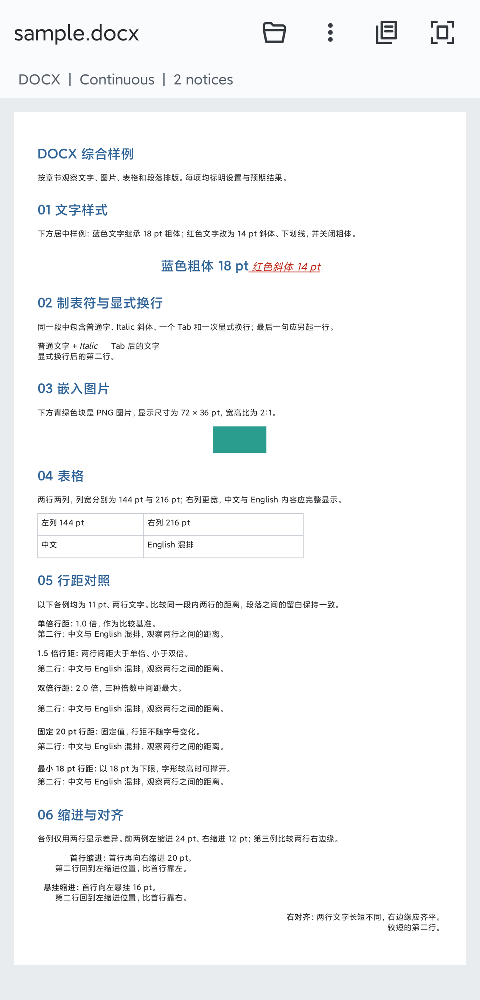
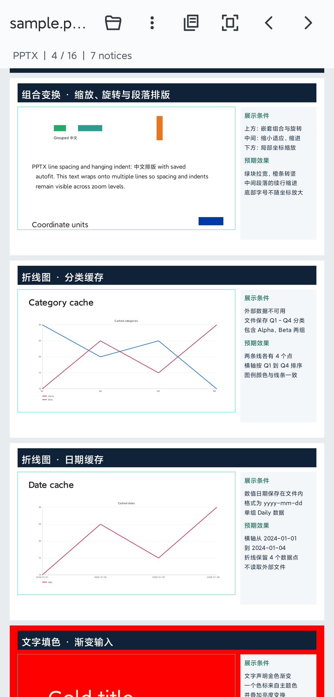
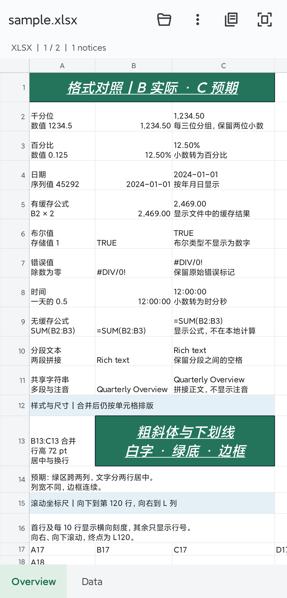

# JZOfficeAndroid

通过 Android `Uri` 预览 DOCX、PPTX 和 XLSX 的有限内容子集。Rust crate `jz-office-core` 解析文档，Android `viewer` 模块负责离线显示，不依赖服务器、WebView、Office 应用或内置字体。可选 `viewer-online` 模块支持下载在线文档后预览。

这是基础预览实现，不保证与 Microsoft Office 的版式一致。旧版 `.doc/.ppt/.xls`、加密文档、ZIP64/分卷容器和编辑功能不在支持范围内。

当前已发布版本为 **0.2.0**，变更见 [CHANGELOG](CHANGELOG.md)。发布产物见 [v0.2.0 Release](https://github.com/donglua/JZOfficeAndroid/releases/tag/v0.2.0)，Maven Central 坐标为 [viewer](https://central.sonatype.com/artifact/io.github.donglua/viewer/0.2.0) 和 [viewer-online](https://central.sonatype.com/artifact/io.github.donglua/viewer-online/0.2.0)。发布可用性以对应仓库为准；完整设备验收尚未完成。

## 预览

Demo 内置样例的 Android 真机截图。点击图片查看大图。

<table>
  <tr>
    <th>DOCX</th>
    <th>PPTX</th>
    <th>XLSX</th>
  </tr>
  <tr>
    <td><a href="docs/images/preview-docx.png"></a></td>
    <td><a href="docs/images/preview-pptx.png"></a></td>
    <td><a href="docs/images/preview-xlsx.png"></a></td>
  </tr>
</table>

## 模块

| 目录 | 职责 |
| --- | --- |
| `core/` | `jz-office-core`：ZIP/OOXML、关系解析、基础样式、平台无关文档模型 |
| `viewer/` | Android AAR：URI 读取、图片解码、文字排版、Canvas 绘制、滚动与缩放 |
| `viewer-online/` | 可选 Android AAR：在线文件下载、进度、取消和缓存清理，再交给 `viewer` 预览 |
| `viewer/native/` | `jz-office-android`：JNI 桥接，生成 `libjz_office.so` |
| `demo/` | 内置样例、文件选择器、`ACTION_VIEW`、在线预览和缓存清理示例 |
| `demo/src/main/assets/samples/` | 每种格式一个综合样例，展示现有样例覆盖的场景 |

`core` 不依赖 Android，不持有 `Context`、`Uri`、`Bitmap` 或 JNI 对象。坐标、尺寸、字号统一使用 point。图片以 ZIP 包内路径引用；Android 层从同一份私有缓存读取图片。

一次 JNI 调用解析整份文档，通过带 `schemaVersion` 的 JSON 模型交给 `viewer`。图片数据不放入 JSON；滚动和缩放不会反复调用 JNI。

## 支持范围

| 格式 | 基础能力 | 简化或省略 |
| --- | --- | --- |
| DOCX | 段落、基础样式继承、字号与颜色、粗斜体和下划线、倍数/固定/最小行距、首行/悬挂/左右缩进、图片、矩形表格 | 连续滚动；图片独占内容块；编号简化；忽略精确分页、浮动环绕、页眉页脚和公式 |
| PPTX | 按演示顺序显示幻灯片、固定坐标文字、文本框垂直对齐、倍数/固定行距、首行/悬挂/左右缩进、已保存的自动缩字、矩形图片裁剪与翻转、矩形/椭圆/直线、数值坐标的自定义路径、图形线性渐变、嵌套组合的位置/缩放/旋转、简单表格及单元格纯色填充与透明度、缓存数据的基础折线图、基础主题色与占位符继承 | 忽略动画、其他图表类型、SmartArt、其他复杂形状、组合整体翻转和 WordArt；不重新计算自动适配；表格行高近似 |
| XLSX | 多工作表、行列标题、双向滚动、合并单元格、行高列宽、基础字体/填充/边框/对齐/换行、常见数字/百分比/日期格式、公式缓存结果 | 不计算公式；忽略工作表图片、图表、条件格式、数据透视表、冻结窗格和打印分页；列宽与边框近似，富文本合并为单元格文字 |

字体使用系统默认字体，可能改变换行。识别到的未支持内容通过 `Info.warnings` 返回；它不是完整兼容性扫描。DOCX 的 `pageCount` 为 1，表示连续内容，不表示原文件页数。

## Android 接入

最低 Android 6.0（API 23）。在 `settings.gradle.kts` 中配置 Maven Central：

```kotlin
dependencyResolutionManagement {
    repositories {
        google()
        mavenCentral()
    }
}
```

在应用模块的 `build.gradle.kts` 中按需选择一种依赖。仅预览本地 URI：

```kotlin
dependencies {
    implementation("io.github.donglua:viewer:0.2.0")
}
```

需要在线预览时，只需添加 `viewer-online`。它通过 `api` 传递依赖同版本的 `viewer`，也可直接使用本地预览接口：

```kotlin
dependencies {
    implementation("io.github.donglua:viewer-online:0.2.0")
}
```

下一版本起，两个模块的 Maven groupId 将改为 `io.github.donglua.office`，artifactId 和 Java 包名不变。升级时需同时更新 groupId 和版本号；已发布的 `0.2.0` 仍使用上面的旧坐标。

`viewer` AAR 默认包含 `arm64-v8a` 和 `armeabi-v7a` 原生库、R8 保留规则。接入项目不需要安装 Rust 或 NDK，`viewer-online` 不额外引入网络库，Demo 样例不进入两个 AAR。

在本仓库开发或调试时，也可以引用源码模块：

```kotlin
dependencies {
    implementation(project(":viewer-online"))
    // 仅需本地预览时，改用 implementation(project(":viewer"))。
}
```

直接引用 AAR 不会解析 Maven 传递依赖。发布工作流生成 `viewer-0.2.0.aar` 和 `viewer-online-0.2.0.aar` 两个 Release 附件；在线预览必须同时引入两者，本地预览只需前者：

```kotlin
dependencies {
    implementation(files("libs/viewer-0.2.0.aar"))
    implementation(files("libs/viewer-online-0.2.0.aar"))
}
```

也可以引用源码模块或本地构建的 AAR，产物位置见「构建」。历史版本见 [v0.1.0 Release](https://github.com/donglua/JZOfficeAndroid/releases/tag/v0.1.0)。

```kotlin
import cn.jingzhuan.lib.office.OfficePreviewView

val preview = OfficePreviewView(context)
container.addView(preview)

preview.open(uri, object : OfficePreviewView.Listener {
    override fun onLoaded(info: OfficePreviewView.Info) {
        // info.format, info.pageCount, info.warnings, info.sheetNames
    }

    override fun onError(error: Exception) {
        showError(error.message)
    }
})
```

`open`、`clear`、`setZoom` 和 `resetZoom` 在主线程调用，回调也在主线程。文件读取、Rust 解析和图片解码在工作线程执行。重复 `open` 会取消旧任务并抑制旧回调；View 脱离窗口时取消文档加载、暂停图片请求并清空图片缓存，已有文档保留暂存文件以支持重新挂载后继续显示。取消正在阻塞的文件提供方读取属于尽力而为。

支持拖动滚动、双指缩放、双击缩放和 `resetZoom()`。`clear()` 释放文档及图片引用，当前图片读取结束后关闭 ZIP 并删除暂存文件。Activity 的 `onDestroy()` 或 Fragment 的 `onDestroyView()` 应调用 `clear()`，Demo 已接入该清理。

`onLoaded` 表示文档模型可用，图片随后按可见区域加载；等待解码时显示占位块。图片读取或解码失败通过 `onError` 通知，其他内容仍可浏览，因此 `onError` 也可能在 `onLoaded` 之后触发。`Info.warnings` 是模型加载时的提示快照。

页码从 1 开始；未加载、加载中、失败或 `clear()` 后，当前页和总页数均为 0。DOCX 为一个连续页面，不表示 Word 的实际页数。PPTX 当前页按视口内可见高度最多的幻灯片计算；可见高度相同时保留当前页。跳转保留缩放，重置横向偏移，并把目标页尽量移到视口顶端。

```kotlin
preview.setOnPageChangeListener { pageNumber, pageCount ->
    pageLabel.text = "$pageNumber / $pageCount"
}
// Can be called after onLoaded; if the view has no size yet, the jump is applied on first layout:
preview.jumpToPage(2)
val currentPage = preview.currentPage
val pageCount = preview.pageCount
```

`setOnPageChangeListener` 和 `jumpToPage` 在主线程调用，页码读取也应在主线程。监听器注册时立即收到当前状态，之后仅在当前页或总页数变化时回调；传入 `null` 可移除监听器。越界跳转抛出 `IllegalArgumentException`；文档已加载但 View 尚无尺寸时，合法跳转会记录目标页并在首次获得非零尺寸时应用。Demo 的上一页/下一页按钮使用同一接口。

XLSX 将每个可见工作表视为一页，`Info.pageCount`、页码监听和 `jumpToPage()` 沿用工作表顺序。`Info.sheetNames` 和 `getSheetNames()` 返回只读表名列表；其他格式返回空列表。切表保留缩放并重置滚动位置，XLSX 缩放范围为 0.5 到 4 倍。Demo 使用底部标签切表。

```kotlin
// Call on the main thread after an XLSX document is loaded; sheet numbers start at 1.
val names = preview.sheetNames
preview.selectSheet(2)
```

隐藏的工作表不显示，隐藏行列保留编号但不占空间。公式只显示文件保存时写入的缓存值，可能不是最新结果；没有缓存时显示公式文本并返回提示。无法识别的数字格式回退到原始值并返回提示，不执行宏或外部链接。

DOCX 行距与缩进沿用默认样式、父样式和直接格式的继承顺序，缩进支持 point 换算的数值；字符单位缩进、网格排版、RTL 和按行单位的段前/段后间距仍为简化预览。PPTX 裁剪支持 `srcRect` 的非负矩形内裁剪；负值外扩、几乎空的裁剪区域或无效值会回退到完整图片并给出提示。图片和基础图形支持水平、垂直翻转，图形内文字保持正向；图片平铺和非矩形蒙版仍未实现。

PPTX 组合保留子元素顺序，支持嵌套位置、非等比缩放和旋转。组合整体翻转暂不应用并返回提示；隐藏组合不显示。组变换应用于绘制和图片可见性判断，离屏图片继续沿用按需加载与释放。异常或过大的变换会被省略并返回提示，组合节点也计入元素预算。

组合子坐标先换算为页面尺寸，再计算文本内边距和布局。字号、行距和描边宽度保持 point 单位，避免文件使用较小的组合坐标单位时，将线宽和文字放大数百倍。

PPTX 文本应用继承后的 `lnSpc`、`marL`、`marR` 和 `indent`。`normAutofit` 使用文件保存的字号比例及百分比行距缩减值，`noAutofit` 和 `spAutoFit` 可清除继承的缩字设置；不根据 Android 字体重新求解自动缩字或扩大文本框。段前/段后百分比间距、自定义制表位和 RTL 仍简化处理。相关语义参见 [DrawingML 组合变换](https://learn.microsoft.com/en-us/dotnet/api/documentformat.openxml.drawing.transformgroup)和 [NormalAutoFit](https://learn.microsoft.com/en-us/dotnet/api/documentformat.openxml.drawing.normalautofit)。

PPTX 渐变文字采用色带中点的纯色近似，并返回提示；按色标位置插值，保留主题色映射和透明度。颜色支持 `lumMod`、`lumOff` 亮度变换，直接纯色或无填充可覆盖继承的渐变文字样式。文字未实现真实渐变着色或 WordArt 特效，不增加字体或渲染依赖。图形的直接线性渐变填充，以及幻灯片、版式和母版的直接线性渐变背景，均保留色标、主题色和透明度；路径渐变与主题样式引用的渐变仍不支持，平铺和独立旋转简化处理。

PPTX 圆角矩形 `roundRect` 支持默认圆角和数值圆角调整，使用短边计算半径，保留填充、描边、透明度和层级顺序；`adj = val 0` 按等效普通矩形绘制。其他预设复杂几何仍不支持。图形的 `useBgFill` 支持纯色和直接线性渐变的幻灯片背景填充；渐变按幻灯片坐标采样，不随图形平移、旋转或翻转。自定义几何支持数值坐标的移动、直线、二次及三次贝塞尔曲线、闭合路径，并保留子路径顺序与逐路径填充/描边开关；弧线、引导公式和特殊填充模式仍省略图形并返回提示，保留文字。

PPTX 图表仅支持单个标准 `lineChart`，读取文件内保存的数值缓存或直接数值，支持分类/日期横轴、线性纵轴、显式范围、断点/补零/跨空值连线、基础主题色、标题和图例。不会读取外部 CSV、打开嵌入工作簿或计算公式。坐标刻度与布局近似，图例统一置于底部，曲线使用直线段，省略标记和复杂样式；组合图、堆积图、对数轴和缺失缓存的图表会被省略并返回提示。复用已有线条和文字元素，不新增图表库、字体或 Android 模型协议。

PPTX 文本框支持继承和覆盖 `wrap`：`none` 按带样式的文字宽度排版，保留显式换行、字号和相对原文本框的左/中/右对齐；`square` 或默认值按文本框宽度换行。非换行文字可以超出文本框，最终仍受幻灯片边界裁剪。

内部 JSON 模型为 `schemaVersion = 8`，包含元素的组合变换、翻转、自定义 DrawingML 路径、图形线性渐变及其坐标空间、表格单元格填充和文本换行字段，core 与 viewer 应使用同次构建产物；不匹配时解码器会明确报错。

## 本地 URI 约定

- 主要入口为 `content://`，也接受应用有权限读取的 `file://`；不把 URI 转换成真实路径。
- 通过 `ContentResolver` 读取流，复制到 `cacheDir` 的临时 ZIP 文件，完成解析和图片解码后删除。
- 文件类型由包内关系与文档结构识别，不依赖扩展名、MIME 或文件提供方的长度信息。
- `ACTION_OPEN_DOCUMENT` 返回的授权由宿主应用管理。只有提供方授予可持久化权限时才调用 `takePersistableUriPermission`；分享 URI 通常只有临时读取权限。
- `viewer` 不声明广泛存储权限，也不请求联网权限。外部图片和远程关系不会下载。

完整选择器与授权处理见 `demo` 的 `MainActivity`。[Android 文件访问文档](https://developer.android.com/training/data-storage/shared/documents-files)说明了 URI 读取和持久化授权。

## 在线链接预览

`viewer-online` 是 0.2.0 新增的可选 Android 库，可通过独立 Maven 坐标或源码模块接入。它把文件直链或签名 URL 下载到应用私有缓存，再调用 `OfficePreviewView.open(Uri)`。需要完整下载后才能预览，不支持边下载边看、断点续传和持久离线缓存。`viewer` 主模块仍保持离线能力，不声明网络权限，也不依赖网络库。

网络权限由 `viewer-online` 的 Manifest 合并到宿主。建议使用 HTTPS；HTTP 是否可用由宿主的 [Android 网络安全配置](https://developer.android.com/privacy-and-security/security-config#CleartextTrafficPermitted)决定，模块不会全局放开明文请求。跨源重定向不转发自定义请求头，也不允许 HTTPS 降级到 HTTP。

```kotlin
val loader = RemoteOfficeLoader(context)
val request = RemoteOfficeRequest.builder("https://example.com/report.xlsx")
    .header("Authorization", "Bearer <token>")
    .displayName("report.xlsx")
    .build()

val task = loader.open(preview, request, object : RemoteOfficeLoader.Listener {
    override fun onProgress(bytesRead: Long, totalBytes: Long) {
        // totalBytes 为 -1 时表示服务器未返回 Content-Length。
    }

    override fun onDownloaded(result: RemoteOfficeDownloader.Result) {
        // 下载完成，随后开始解析和预览。
    }

    override fun onLoaded(info: OfficePreviewView.Info) {
        // info.format, info.pageCount, info.warnings, info.sheetNames
    }

    override fun onError(error: Exception) {
        showError(error.message)
    }
})
```

一个 `RemoteOfficeLoader` 绑定一个 `OfficePreviewView`。`open()`、`Task.cancel()` 和 `close()` 必须在主线程调用；所有 loader 回调也在主线程执行。`onLoaded()` 后仍可能收到图片解码的 `onError()`。切换为直接调用 `preview.open(localUri, ...)` 前，先取消当前在线任务；Activity 销毁或 Fragment 的 `onDestroyView()` 中调用 `loader.close()`。视图离开窗口也会取消在线会话并清空预览。

`Task.cancel()` 立即使旧任务回调失效并清空其预览，后台尝试断开连接；已经阻塞的网络读取可能等到读取超时才退出，随后释放临时文件。同一 loader 的后续下载需等待该下载线程退出。连接与读取超时默认为 15 秒、30 秒，可在 request 中缩短。`isComplete()` 表示初始加载已经成功、失败或取消；加载成功后取消任务仍会关闭当前预览。

默认下载器使用 Android `HttpURLConnection`，不引入 OkHttp。需要统一鉴权、Cookie、证书、代理或日志时，可以实现 `RemoteOfficeDownloader` 并传入构造函数。下载器应遵守大小上限、取消标记和 `onCancel()` 连接释放约定；临时文件由 loader 管理。默认上限为 128 MiB，可调低，不能超过现有解析器上限。

### 清理缓存

```kotlin
loader.clearCache { result ->
    val releasedBytes = result.deletedBytes
    val removedFiles = result.deletedFiles
    val inUseFiles = result.skippedFiles
    val failedFiles = result.failedFiles
}

// 没有 loader 实例时也可以调用；清理完成后在主线程回调。
RemoteOfficeLoader.clearCache(context) { result ->
    showClearedSize(result.deletedBytes)
}
```

下载临时文件与预览副本统一存放在 `cacheDir/office-preview/`，由 `viewer` 中的 `OfficeCache` 记录使用状态。清理在独立后台线程执行，只删除该目录中本库命名的闲置文件，不遍历应用的其他缓存，也不删除正在下载、解析或显示的文件。结果中的 `failedFiles` 计入删除失败；目录无法读取时计为 1 次失败。

下载失败、取消或预览关闭后，文件在最后一个使用者释放时自动删除。首次创建缓存或初始化 loader 时清理前次进程退出的残留。缓存使用状态在同一应用进程内共享；当前版本不支持多个进程共用该目录。清理操作可以重复执行，也可以在 loader 关闭后调用。

当前 URI 接口会再复制一份预览文件，单个文档交接时可能占用约两倍文件大小的磁盘空间。DOCX/PPTX 的预览副本需保留至关闭，以供延迟加载图片；XLSX 解析完成即可释放。Demo 的 `More` 菜单提供在线打开、取消、重试、关闭文档和清理缓存。

### 在线模块验证

本地 HTTP/HTTPS 和缓存检查使用 JDK 11 及以上运行，无额外测试依赖：

```sh
mkdir -p /tmp/jz-office-online-checks
javac --release 11 -d /tmp/jz-office-online-checks \
    viewer/src/main/java/cn/jingzhuan/lib/office/OfficeCache.java \
    viewer-online/src/main/java/cn/jingzhuan/lib/office/online/RemoteOfficeRequest.java \
    viewer-online/src/main/java/cn/jingzhuan/lib/office/online/RemoteOfficeDownloader.java \
    viewer-online/src/main/java/cn/jingzhuan/lib/office/online/HttpUrlConnectionOfficeDownloader.java \
    scripts/tests/OfficeCacheChecks.java scripts/tests/RemoteDownloaderChecks.java
java -cp /tmp/jz-office-online-checks cn.jingzhuan.lib.office.OfficeCacheChecks
java -cp /tmp/jz-office-online-checks RemoteDownloaderChecks
```

Android 集成检查覆盖三种格式的下载交接、预览中清理、取消后打开本地文件、回调内取消与关闭后的文件释放，需连接支持已打包 ABI 的设备：

```sh
./gradlew :viewer-online:assembleDebug :demo:assembleDebug :viewer-online:assembleDebugAndroidTest
adb install -r viewer-online/build/outputs/apk/androidTest/debug/viewer-online-debug-androidTest.apk
adb shell am instrument -w cn.jingzhuan.lib.office.online.test/cn.jingzhuan.lib.office.online.OnlineInstrumentation
```

## 构建

源码构建需要 JDK 21、Android SDK 35、NDK `28.2.13676358`、通过 rustup 安装的 Rust 1.87 或更新版本。`gradle/gradle-daemon-jvm.properties` 已为 Gradle daemon 固定 JDK 21，本地与 CI 的构建和 Javadoc 生成使用同一版本，无需临时改写该文件。`rustup` 和 `cargo` 需要在构建进程的 `PATH` 中可用；Android Studio 也需要能找到这两个命令。使用 `ANDROID_HOME`、`ANDROID_SDK_ROOT` 或 `local.properties` 配置 SDK。

```sh
./gradlew :viewer:assembleRelease :viewer-online:assembleRelease :demo:assembleDebug
```

Gradle 的 `buildNative` 任务会通过原生构建脚本检查当前 Rust 工具链的 target，仅对缺失项执行 `rustup target add`，再编译并打包 `.so`。无需手动安装 Android target；首次缺少 target 时需要联网。Rust/rustup 本身仍需预先安装。

默认同时打包 `arm64-v8a` 和 `armeabi-v7a`，兼容 ARM64 与 ARM32。需要 x86_64 时指定 ABI，对应 target 会自动准备：

```sh
./gradlew :viewer:assembleRelease -PofficeAbis=arm64-v8a,armeabi-v7a,x86_64
```

只需要某一种架构时，可使用 `-PofficeAbis=arm64-v8a` 或 `-PofficeAbis=armeabi-v7a`。宿主应用也必须包含对应架构的所有其他原生依赖。

`./gradlew --offline :viewer:assembleRelease` 不安装缺失 target，Cargo 也使用离线模式。离线构建前需准备好 Gradle/Cargo 依赖缓存和所选 ABI 的 Rust target；缺少 target 时构建会给出明确提示并停止。

原生构建脚本支持 macOS 和 Linux；Windows 构建未实现。NDK 链接时设置 16 KiB ELF 段对齐。多 ABI AAR 可以由宿主应用的 `abiFilters` 或 AAB 分发选择；单 APK 包含多个 ABI 时会增大体积。[Android ABI 文档](https://developer.android.com/ndk/guides/abis)解释了这些差异。

产物位置：

```text
viewer/build/outputs/aar/viewer-release.aar
viewer-online/build/outputs/aar/viewer-online-release.aar
demo/build/outputs/apk/debug/demo-debug.apk
```

Rust 核心可独立使用：

```rust
let document = jz_office_core::parse_path(std::path::Path::new("sample.docx"))?;
```

## 发布到 Sonatype Central

下一版本的坐标为 `io.github.donglua.office:viewer:<version>` 和 `io.github.donglua.office:viewer-online:<version>`。两个模块使用共享 Gradle 发布配置，分别生成 release AAR、sources JAR、Javadoc JAR、POM 和 Gradle Module Metadata，上传时附带 GPG 签名。`viewer-online` 的发布依赖指向同组、同版本的 `viewer`。

### 本地准备

当前默认版本仍为 `0.2.0`，下一版本号尚未指定；正式发布前需同步更新根项目默认版本、Demo 的 `versionName` 和 Rust workspace 版本。以下命令仅在本地生成并检查新 groupId 下两个模块的发布内容：

```sh
./gradlew :prepareRelease
```

根任务 `:prepareRelease` 将两个模块的发布文件写入 `build/release-repository/`，检查 POM 和 Gradle 元数据坐标、模块间依赖以及 AAR 内容，不上传 Sonatype。未配置签名密钥时，本地准备会跳过签名；正式发布要求完整的 POM 信息和签名配置。默认坐标对应目录为：

```text
build/release-repository/io/github/donglua/office/viewer/0.2.0/
build/release-repository/io/github/donglua/office/viewer-online/0.2.0/
```

本地准备通过不代表 Maven Central 已发布，也不替代设备验收。当前检查状态见「验证」。

### 发布凭据

实际发布必须使用下一版本号，并确保坐标位于 Central Portal 已验证的 namespace 下。`io.github.donglua.office` 属于已验证的父 namespace `io.github.donglua`，`sonatypeNamespace` 保持不变；授权规则见 [Sonatype 文档](https://central.sonatype.org/faq/namespaces-vs-groupids/)。以下配置中的 `<next-version>` 需替换为实际版本号。

Central Portal 的 Portal Token 和签名信息只放在用户级 Gradle 属性或环境变量中，不要提交到仓库。例如：

```properties
publishedGroupId=io.github.donglua.office
publishedArtifactId=viewer
publishedVersion=<next-version>
publishedLicenseName=Apache License, Version 2.0
publishedLicenseUrl=https://www.apache.org/licenses/LICENSE-2.0.txt
publishedDeveloperName=Your Name
publishedDeveloperEmail=you@example.com
sonatypeNamespace=io.github.donglua
sonatypeUsername=<portal-token-username>
sonatypePassword=<portal-token-password>
signing.secretKeyRingFile=/absolute/path/to/secring.gpg
signing.keyId=<gpg-key-id>
signing.password=<gpg-passphrase>
```

也可以用 `SONATYPE_USERNAME`、`SONATYPE_PASSWORD`、`SIGNING_KEY` 和 `SIGNING_PASSWORD` 环境变量提供 Portal Token 与 ASCII-armored 私钥。

### GitHub Actions 配置

仓库中的 [发布工作流](.github/workflows/publish-sonatype.yml) 名为 **Publish libraries to Sonatype Central**，在发布 GitHub 正式 Release 时自动运行，并使用 `maven-central` environment。仅推送 tag 不会触发发布，草稿和预发布版也不会自动发布 Maven Central。工作流使用仓库固定的 JDK 21。

维护发布环境时，在 GitHub 仓库的 Settings 中配置以下 Actions Secrets：

| Secret | 内容 |
| --- | --- |
| `SONATYPE_USERNAME` | Central Portal User Token 的 username |
| `SONATYPE_PASSWORD` | Central Portal User Token 的 password |
| `SIGNING_KEY` | ASCII-armored GPG 私钥全文 |
| `SIGNING_PASSWORD` | GPG 私钥口令 |

再配置以下 Actions Variables。它们会写入发布 POM；`SONATYPE_NAMESPACE` 必须是 Central Portal 中已验证的 namespace：

| Variable | 内容 |
| --- | --- |
| `SONATYPE_NAMESPACE` | `io.github.donglua`，须已在 Central Portal 验证 |
| `PUBLISHED_ARTIFACT_ID` | `viewer` 的 artifactId，默认 `viewer`；在线模块自动使用 `<viewer artifactId>-online` |
| `PUBLISHED_NAME` | POM 中的项目名 |
| `PUBLISHED_DESCRIPTION` | POM 中的项目描述 |
| `PUBLISHED_URL` | 项目主页或 GitHub 仓库地址 |
| `PUBLISHED_LICENSE_NAME` | 真实使用的许可证名称 |
| `PUBLISHED_LICENSE_URL` | 许可证 URL |
| `PUBLISHED_DEVELOPER_ID` | 开发者 ID |
| `PUBLISHED_DEVELOPER_NAME` | 开发者姓名或组织名 |
| `PUBLISHED_DEVELOPER_EMAIL` | 开发者公开邮箱 |

`SONATYPE_NAMESPACE` 未配置时使用默认值 `io.github.donglua`。发布工作流不再读取 Actions Variable `PUBLISHED_GROUP_ID`，而是使用所检出标签的 `build.gradle` 中的默认 groupId；旧标签仍保留原坐标。本地发布若曾配置 `publishedGroupId` 属性或 `PUBLISHED_GROUP_ID` 环境变量，需移除覆盖或更新为 `io.github.donglua.office`。

正式发布时，基于待发布提交创建 tag，再发布 GitHub 正式 Release。0.2.0 对应标签为 `v0.2.0`；工作流去掉 `v` 前缀，将该 tag 对应的两个模块以同一版本发布。版本号必须为三段数字，不接受 `-rc`、`-beta`、`-SNAPSHOT` 等后缀。

工作流监听 `release.released`，也支持将预发布版转为正式版，但 tag 仍须符合上述格式。上传前先运行 Java 网络与缓存检查、Rust 检查和 `:prepareRelease`；随后通过根任务 `:publishToSonatype` 签名并上传两个模块，全部上传后只向 Central Portal 交接一次。Sonatype 验证通过后自动发布 Maven Central，部署状态可在 [Central Portal](https://central.sonatype.com/publishing) 查看。

工作流提交 Sonatype 发布后，会将同次构建的两个 AAR 以 `viewer-<版本号>.aar` 和 `viewer-online-<版本号>.aar` 上传到对应 GitHub Release 的 Assets；Demo APK 仍需自行构建。附件上传成功不代表 Maven Central 已可解析，仍需确认 Portal 发布状态。

也可以在 Actions 中手动运行 **Publish libraries to Sonatype Central**，选择包含最新工作流的 `main` 分支，输入版本号（例如 `0.2.0` 或 `v0.2.0`）。运行前需已创建对应的 `v0.2.0` 标签和 GitHub Release。手动入口固定检出该标签并发布其源码；所选工作流分支不改变发布源码。此方式可用于修复 CI 后重试尚未成功的发布，不要重用已发布到 Maven Central 的版本号。若只有附件上传失败，可直接补传 AAR，无需重新发布 Maven 版本。Release 的事件语义见 [GitHub 文档](https://docs.github.com/en/actions/reference/workflows-and-actions/events-that-trigger-workflows#release)，自动发布模式见 [Sonatype 文档](https://central.sonatype.org/publish/publish-portal-ossrh-staging-api/#post-to-manualuploaddefaultrepositorynamespace)。

### 本地发布

完成 `:prepareRelease` 和设备验收，确认坐标、许可证、开发者信息、签名和 Portal namespace 后，正式发布时执行：

```sh
./gradlew :publishToSonatype
```

根任务上传两个模块后只向 Portal 交接一次。旧命令 `:viewer:publishToSonatype` 保留为兼容入口，同样发布两个模块。本地默认使用 `user_managed` 模式，上传后在 Central Portal 手动发布；需要验证通过后自动发布时，增加 `-PsonatypePublishingType=automatic`，GitHub Actions 已使用该参数。Central 发布后坐标不可修改或删除。

## 验证

0.2.0 验证记录：Debug/Release 构建、lint、47 项网络检查、缓存检查和 Rust 检查已通过。双模块本地发布产物检查已通过；独立消费项目使用 Gradle 元数据和纯 POM 均能从 `viewer-online:0.2.0` 解析出同版本的 `viewer`。正式签名和上传由发布 CI 执行，结果见 [Actions](https://github.com/donglua/JZOfficeAndroid/actions/workflows/publish-sonatype.yml)。`demo-samples` 已在 Android 真机通过，覆盖三种内置样例的打开、格式识别、翻页和截图；**在线预览及其他测试套件的完整设备验收尚未完成**。以下命令为复验入口，不表示所有设备测试均已执行。

```sh
cargo test --workspace
cargo clippy --workspace --all-targets -- -D warnings
cargo fmt --all -- --check
cargo run -p jz-office-core --example fixtures
./gradlew :viewer:assembleDebugAndroidTest
adb install -r viewer/build/outputs/apk/androidTest/debug/viewer-debug-androidTest.apk
adb shell am instrument -w cn.jingzhuan.lib.office.test/cn.jingzhuan.lib.office.OfficeInstrumentation
```

设备测试使用自定义 Instrumentation，以输出 `ALL CHECKS PASSED` 为通过标志。覆盖无真实路径、无文件长度的管道型 `content://`，DOCX/PPTX/XLSX 渲染、双击缩放、错误回调、URI 切换、临时文件清理和不同尺寸的截图。

Demo 启动时显示样例列表，打开文档后可点击工具栏的「Open sample」重新选择。列表直接读取 `demo/src/main/assets/samples/`，通过 Demo 私有的 `content://` provider 打开文档。该目录只保留以下三个文件，打入 Demo APK 和测试 APK，不进入 viewer AAR。

| 文件 | 内容 |
| --- | --- |
| `sample.pptx` | 16 页：中文目录、基础元素、组合变换、折线图、文字填色、字体排版、换行对照、背景与透明图片；每页标明条件与预期 |
| `sample.docx` | 6 个章节：文字样式、Tab/显式换行、图片、表格、行距、缩进与对齐；用短例句说明设置与效果 |
| `sample.xlsx` | Overview、Data 两个工作表：条件/实际/预期对照、合并样式、公式缓存、格式化及稀疏滚动坐标尺 |

样例生成器位于 `core/examples/fixtures.rs`，生成逻辑复用 `core/tests/support/`。默认生成三个综合文档，也可在命令后指定输出目录。PPTX 合并时保留各组主题、母版、媒体与图表关系，统一为 960 × 540 point 页面。

第 11–13 页将 9 种换行案例合为 3 页对照：分别采用左对齐、居中对齐、右对齐，每页并列展示不自动换行、显式换行和按框宽自动换行。青色边框标出原始文本框，各栏复用专项文件中的文本定义。其余案例页在青色框内保留原有元素，右侧说明展示条件与预期效果；第 14–16 页展示背景与透明图片。渐变文字与纯色参照保留两种输入，并明确当前预览使用代表色。

DOCX 的 8 种段落案例各保留两行，便于比较行距、缩进和右对齐。XLSX 在同一行并列展示原值条件、实际结果及预期；Overview 的下半部仅作为滚动坐标尺，每 10 行给出横向刻度，终点为 L120。

专项设备测试使用同一套生成代码产出小文档，以便定位失败场景。Gradle 在打包测试 APK 前自动生成到 `viewer/build/generated/test-fixtures/`；可运行 `cargo run -p jz-office-core --example fixtures -- --tests` 手动生成。它们不进入 Demo APK。新增渲染案例应同时纳入综合样例和专项断言；无效输入、资源限制和交互状态仍由代码测试覆盖。

XLSX 专项使用 `-e suite xlsx`，以 `ALL XLSX CHECKS PASSED` 为通过标志，覆盖管道 URI、表名顺序、切表与页码、双向滚动、缩放、快速换文件、合并区域、隐藏行列和有界文字布局缓存。

```sh
adb shell am instrument -w -e suite xlsx cn.jingzhuan.lib.office.test/cn.jingzhuan.lib.office.OfficeInstrumentation
```

Demo 标签检查需要先安装 Debug Demo 和测试 APK，使用内置工作簿。该检查通过无障碍点击切换工作表，断言选中状态与页码并保存实际窗口截图；它不替代系统触摸注入检查。

```sh
adb install -r demo/build/outputs/apk/debug/demo-debug.apk
adb shell am instrument -w -e suite demo-xlsx cn.jingzhuan.lib.office.test/cn.jingzhuan.lib.office.OfficeInstrumentation
```

通过标志为 `ALL DEMO XLSX CHECKS PASSED`。样例入口检查使用 `-e suite demo-samples`，逐个选择内置文档、核对格式与页码、翻页并保存截图，通过标志为 `ALL DEMO SAMPLE CHECKS PASSED`。

仅运行新增排版、图片裁剪和页码接口检查时，增加 `-e suite layout`，以 `ALL LAYOUT CHECKS PASSED` 为通过标志。该组检查包含真实 `StaticLayout` 坐标、Canvas 像素、窗口截图、拖动页码、布局前跳转和错误状态；完整测试仍保留独立的系统触摸注入用例。

```sh
adb shell am instrument -w -e suite layout cn.jingzhuan.lib.office.test/cn.jingzhuan.lib.office.OfficeInstrumentation
```

在支持 32 位应用的设备上，可以指定 ARM32 安装并启动测试，避免默认选择 ARM64：

```sh
adb install -r --abi armeabi-v7a viewer/build/outputs/apk/androidTest/debug/viewer-debug-androidTest.apk
adb shell am instrument --abi armeabi-v7a -w cn.jingzhuan.lib.office.test/cn.jingzhuan.lib.office.OfficeInstrumentation
```

## 资源限制

DOCX、PPTX、XLSX 输入文件最多 128 MiB，ZIP 声明的解压总量最多 256 MiB、4096 个条目；单个 XML 最多 4 MiB、60000 个节点、64 层嵌套。PPTX 最多 100 页，累计最多 5000 个元素、组合节点和表格单元格。DTD 被拒绝，关系路径不能逃出包根目录。

每个 PPTX 折线图最多 8 个系列、每系列 2048 个数据槽位、合计 4096 个槽位，超过时省略该图表并提示。图表生成的线段、坐标轴和文字也计入整份 PPTX 的 5000 元素上限。

XLSX 最多 32 个工作表，每表最多 10000 行、256 列；整份文件最多 50000 个存储单元格、50000 个共享字符串、2048 个样式、1000 个合并区域，累计文字预算 8 MiB。单元格以稀疏列表保存，Android 只绘制可见区域，文字布局缓存最多 256 项并受文字量预算约束。仍一次解析完整模型；XML 等通用限制可能更早触发，不代表支持任意 50000 单元格文件。

Android 仅缓存可见区域的图片，离屏时移除缓存引用，返回该区域后重新解码；相同图片路径共用缓存。解码最长边不超过 4096 像素，当前缓存总预算为 800 万像素（ARGB_8888 约 30.5 MiB）。首次加载按图片数量分配预算，随后将小图和采样后剩余的预算优先用于当前页前景图片；可见区域或优先级变化后会重新评估分辨率，升级期间继续显示已有图片。实际清晰度仍受源图分辨率、裁剪、采样和缩放倍率影响。缓存预算不含正在解码的单张图片、压缩数据、系统渲染缓存及等待垃圾回收的旧 Bitmap，不是应用总内存上限。文档结构仍使用有界整份模型，尚未实现按页解析。

文件上限不代表渲染内存上限：单张图片的压缩数据最多 16 MiB，两层各自的内容读取预算为 256 MiB；Android 层按每个 ZIP 条目已读取的最大字节数计费，翻页重新读取同一图片不会重复扣额度。较大的文件仍可能触发 XML、图片或文档模型限制。使用 `-e suite limits` 运行容器大小专用设备测试，以 `ALL LIMIT CHECKS PASSED` 为通过标志。

图片缓存回归使用 `-e suite images`，以 `ALL IMAGE CHECKS PASSED` 为通过标志。覆盖大小图片混合时的预算分配、优先级变化与清晰度升级、放大后的单像素细节，以及超过 96 MiB 的 16 页 PPTX 加载、跳页、拖动、返回、累计超过 256 MiB 的图片重复读取、离屏缓存释放、重新挂载、快速换文件和清理。

PPTX 兼容性回归使用 `-e suite pptx`，通过标志为 `ALL PPTX CHECKS PASSED`。自动生成的 `pptx-compat.pptx` 包含嵌套组合、旋转、翻转图片、缩字段落，以及使用 635 倍坐标换算的细描边和文字；检查组合坐标、Canvas 像素、行距与缩进、可见图片缓存，以及缩放和跳页。对应内容也合入 Demo 的 `sample.pptx`。该入口不会执行完整测试组。

同一入口包含 `pptx-charts.pptx`：两页分类/日期折线图，使用缓存数据并引用不存在的外部 CSV；通过 JNI/管道 URI 加载，检查曲线像素、标题、边界及两种尺寸的截图。

`pptx-colors.pptx` 包含红底渐变标题及等效纯色参照页。通过管道 URI/JNI 检查主题色与亮度变换结果，并在两种尺寸下检查金色文字像素和错误黑色像素。

`pptx-wrapping.pptx` 覆盖左、中、右对齐下的不换行、显式断行和普通换行；`pptx-backgrounds.pptx` 覆盖继承渐变背景、透明 PNG、纯色页及旋转/翻转图形的背景填充。两组专项检查保留行数、对齐、溢出和背景像素断言；这些场景也合入综合 PPTX。

```sh
adb shell am instrument -w -e suite pptx cn.jingzhuan.lib.office.test/cn.jingzhuan.lib.office.OfficeInstrumentation
```

## 许可证

本项目采用 [Apache License 2.0](LICENSE)。
